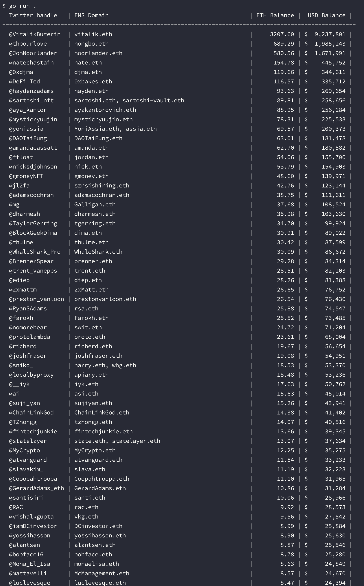

# weird.flex.eth

A lot of people on crypto Twitter have their ENS domain in their profile. So, question then is who has the most ETH publicly on display?

## Why?

I don't really care about who is showing off the biggest ETH balance. I'm just trying to learn Go. I've never written anything in Go before, so I just wanted to write something that was...

* Simple enough to do in a weekend
* Complex enough that I'd have to think about how I organize the code
* Complex enough that I can spend part of the weekend refactoring the code to further increase my familiarity with Go
* Of zero consequence in my life otherwise so I don't have to ever edit this code again

Beyond that, my only other rules for myself were to avoid using an open source library for most things since the entire point of this is learning. That is why 2/3 of the API clients in this repo are hand written.

## What?

Here is what this repo does:

1. Takes a list of usernames in `config/seed.json`. This should be your Twitter username, some of your friends, and maybe a few popular crypto people if you want to pull in more data
2. For each seed user, it scrapes who they follow via the Twitter API
3. For the pool of users compiled from that scrape, we then filter down to the users who have an [ENS domain](https://ens.domains/) in their display name or bio
4. For each of ENS domains, we resolve the domain to an ETH address
5. Using the Etherscan API, we check the balance of each ETH address we resolve
6. Finally, we print out a little sorted table displaying each person's Twitter handle, ENS domain(s), ETH balance, and equivalent ETH balance denominated in USD

Like this:

## Contributing

No thanks!
